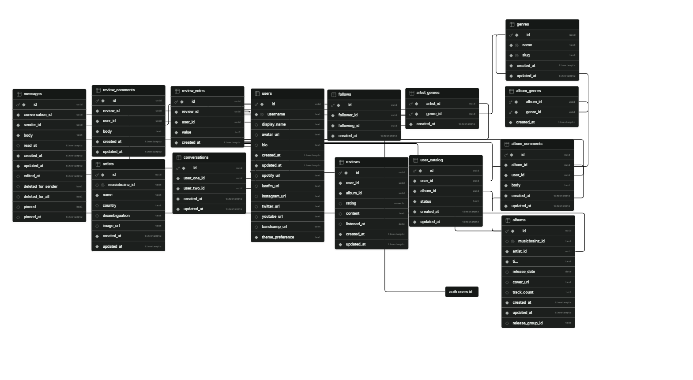

# music-social

**A social network for music obsessives, with the one feature every rating site forgets: actually talking to people.**

[](https://react.dev)
[](https://www.typescriptlang.org)
[](https://nodejs.org)
[](https://supabase.com)
[](https://vitejs.dev)

---

## Why this exists

Sites like RateYourMusic built a genuinely great model for cataloguing music and comparing taste with other people — but they were built for a web that didn't expect you to *talk* to anyone. Reviews, ratings, and charts, sure. A DM to tell a friend "you need to hear this album right now"? Not really part of the picture.

**music-social** takes that same core idea — catalogue what you listen to, rate it, see what your taste says about you — and treats messaging as a first-class feature instead of an afterthought. Find someone with your exact taste in 2000s shoegaze through the "similar taste" filter, and just message them. No context-switching to another app.

It's also a from-scratch build on a modern stack (React, TypeScript, Supabase) rather than a legacy codebase, with a design system built around a real light/dark theme rather than a single hardcoded palette.

## What sets it apart

- **Messaging is native, not bolted on.** Pin important messages, edit within 24h, unsend within 15 minutes — the kind of message controls you'd expect from a real chat app, not a comment thread.
- **Taste-based social discovery.** Beyond following people you already know, browse users by "similar taste to me" or "opposite taste to me," computed from actual rating overlap.
- **Smart album caching.** Album search hits MusicBrainz and Cover Art Archive, but results are deduplicated by *release-group* rather than by individual *release* — so you don't end up with five nearly-identical entries for the same album because MusicBrainz has five pressings of it.
- **A real design system.** Every screen shares the same token-based light/dark theme, not a single dark palette with no alternative.

## Features

### Accounts & profiles
- Email/password auth with JWT (Supabase Auth)
- Editable profile: avatar, bio, social links (Spotify, Last.fm, Instagram, X, YouTube, Bandcamp)
- Profile stats: review count, average rating, followers, following
- Light/dark theme preference, saved per user

### Albums & artists
- Album search against MusicBrainz with intelligent local caching (deduplicated by release-group, not by individual release)
- Cover art via Cover Art Archive, genre data via Last.fm as fallback
- Album detail pages with tracklist, artist link, genres, and reviews
- Artist search and discography pages

### Reviews
- Full CRUD (0.5–5 rating, text content), one review per user per album
- Comments on reviews (create, paginated list, delete own)
- Global review feed with "All" / "Following" filters

### Charts
- Four views: Most Reviewed, Top All Time, Top by Year, Top by Genre

### Social
- Follow / unfollow with public counters
- Browse users by: all, top reviewers, favorite genre, similar taste, opposite taste

### Direct messaging
- One-on-one conversations with optimistic send
- Pin up to 2 messages per conversation
- Edit messages within a 24-hour window
- Unsend for yourself, or for both parties within 15 minutes
- Opens to the most recent message, loading older history on scroll-up

### Platform
- Unified error handling — no raw API errors reach the UI
- Pagination on all major listings
- Rate limiting (general + stricter on auth) plus a 1 req/sec throttle on outbound MusicBrainz calls
- Fully responsive (mobile / tablet / desktop)
- Custom confirmation modals (no native browser dialogs)

## Tech stack

| Layer | Technology |
|---|---|
| Frontend | React + TypeScript + Vite + Zustand + CSS Modules |
| Backend | Node.js + Express + TypeScript (layered architecture: controller → service → repository) |
| Database | Supabase (PostgreSQL), Row-Level Security on every table |
| Auth | JWT via Supabase Auth |
| External APIs | [MusicBrainz](https://musicbrainz.org) (albums/artists), [Cover Art Archive](https://coverartarchive.org) (artwork), [Last.fm](https://www.last.fm) (genres) |

## Database schema



## Project structure

```
music-social/
├── backend/src/
│   ├── features/           # albums, artists, auth, charts, follows, messages, reviews, users
│   ├── shared/
│   │   ├── integrations/   # musicbrainz, cover-art-archive, lastfm
│   │   ├── middleware/     # auth, error handling, rate limiting
│   │   └── errors/
│   └── scripts/            # backfill-genres, merge-duplicate-albums
└── frontend/src/
    ├── features/           # mirrors the backend domains
    ├── shared/
    │   ├── api/
    │   ├── components/     # primitives: Button, Input, Card, Badge, ConfirmDialog
    │   └── stores/
    └── styles/              # tokens.css (design tokens, light/dark theme), globals.css
```

## Getting started

### Requirements
- Node.js 18+
- A [Supabase](https://supabase.com) account and project
- (Optional) A [Last.fm API key](https://www.last.fm/api/account/create)

### Setup

```bash
git clone https://github.com/seggovia/music-social.git
cd music-social
npm install
```

Create `backend/.env` from `.env.example`:

```env
PORT=3001
CORS_ORIGIN=http://localhost:5173
SUPABASE_URL=your_supabase_url
SUPABASE_SERVICE_ROLE_KEY=your_service_role_key
LASTFM_API_KEY=your_lastfm_api_key
```

Create `frontend/.env` from `frontend/.env.example` and provide the project's
Supabase URL plus its public/anon key. The key is safe to expose in the browser;
never put `SUPABASE_SERVICE_ROLE_KEY` in the frontend.

Apply the SQL migrations in `supabase/migrations/` via your Supabase project's SQL Editor, in numeric order.

Run backend + frontend together:

```bash
npm run dev
```

- Frontend: `http://localhost:5173`
- Backend: `http://localhost:3001`

### Useful scripts

```bash
# Type-check the backend
cd backend && npx tsc --noEmit

# Backfill genres for albums missing them
npx tsx src/scripts/backfill-genres.ts

# Merge duplicate cached albums (dry-run by default)
npx tsx src/scripts/merge-duplicate-albums.ts
npx tsx src/scripts/merge-duplicate-albums.ts --execute
```

## Roadmap

Planned, not yet implemented:

- [x] Real-time messaging (Supabase Realtime)
- [ ] Review voting (+/-)
- [ ] "Listened" catalog (without requiring a review)
- [ ] Notifications
- [ ] Real avatar upload (currently URL-only)
- [ ] Edit/delete review from the review form
- [ ] "Top 4" featured albums on profile
- [ ] Personalized "Year in Review"
- [ ] Automated tests
- [ ] Production deployment (Vercel + Railway/Render)

## License

Not yet decided.
